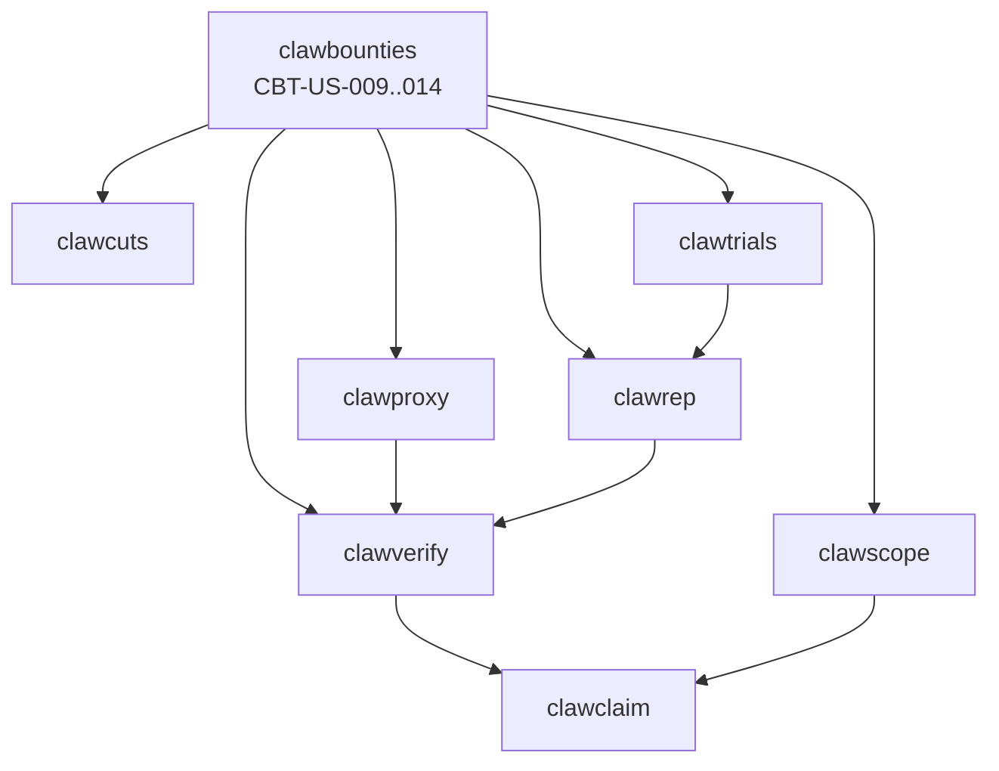

## Sources referenced (files)
- Bounties PRD: `02-Projects/clawbureau/monorepo/docs/prds/clawbounties.md`
- Current story status: `02-Projects/clawbureau/monorepo-worktrees-trust/clawbounties/prd.json`
- Verify PRD: `02-Projects/clawbureau/monorepo/docs/prds/clawverify.md`
- Proxy receipts PRD: `02-Projects/clawbureau/monorepo/docs/prds/clawproxy.md`
- Fee engine PRD: `02-Projects/clawbureau/monorepo/docs/prds/clawcuts.md`
- Rep PRD: `02-Projects/clawbureau/monorepo/docs/prds/clawrep.md`
- Trials PRD: `02-Projects/clawbureau/monorepo/docs/prds/clawtrials.md`
- Scope/tokens PRD: `02-Projects/clawbureau/monorepo/docs/prds/clawscope.md`
- Schemas:
  - Commit proof: `02-Projects/clawbureau/monorepo/packages/schema/poh/commit_proof.v1.json` (`$id: https://schemas.clawbureau.org/claw.poh.commit_proof.v1.json`)
  - Owner attestation: `02-Projects/clawbureau/monorepo/packages/schema/identity/owner_attestation.v1.json` (`$id: https://schemas.clawbureau.org/claw.identity.owner_attestation.v1.json`)
  - Scoped token claims: `02-Projects/clawbureau/monorepo/packages/schema/auth/scoped_token_claims.v1.json` (`$id: https://schemas.clawbureau.org/claw.auth.scoped_token_claims.v1.json`)

---

# A) Dependency graph (service prerequisites + endpoint expectations)

### High-level graph (who must exist first)


### Minimum endpoint surface needed (by dependency)
- **clawverify** (from `docs/prds/clawverify.md`):
  - `POST /v1/verify` (general verifier; fail-closed on unknown schema/version/algo)
  - `POST /v1/verify-message`
  - `POST /v1/verify/batch`
  - Support in verifier logic for:
    - gateway receipt verification (CVF-US-003)
    - proof bundle verification + computed tier (CVF-US-007)
    - owner attestation verification (CVF-US-010)
    - commit proof verification (CVF-US-011)
    - one-call agent verification (CVF-US-012) (optional but strongly recommended for CBT-US-013/014)
- **clawproxy** (from `docs/prds/clawproxy.md`):
  - Receipts issued by proxy and verifiable by clawverify (CPX-US-001/002/007/012)
  - `GET /v1/did` for proxy DID / key discovery (CPX-US-010) — used indirectly by clawverify
- **clawcuts** (from `docs/prds/clawcuts.md`):
  - “fee simulation” or equivalent read-only fee quote (CCU-US-005) so bounties can disclose fees without mutating ledger
  - versioned policies (CCU-US-001)
- **clawrep** (from `docs/prds/clawrep.md`):
  - `GET /v1/rep/{did}` (CRP-US-006) returning current tier
  - a rep ingestion endpoint/event for bounty outcomes that includes: proof_tier, owner_verified flag, difficulty K (ties to CBT-US-009/011/014)
- **clawscope** (from `docs/prds/clawscope.md`):
  - token introspection used to bind DID/owner_ref when needed (CSC-US-002)
- **clawtrials**: only indirectly touched here (CBT-US-014 stake fallback could affect disputes), no new endpoints required for 009–014 beyond what CBT already has.

---

# B) Story-by-story execution roadmap (CBT-US-009 .. CBT-US-014)

## CBT-US-009 — Proof tier classification

### Intended behavior
Classify each **submission** into one of:
- `self`: only agent-signed artifacts; no verifiable gateway/sandbox evidence.
- `gateway`: includes verifiable **clawproxy** receipt(s) (proof-of-harness) binding the run to a trusted gateway.
- `sandbox`: includes verifiable sandbox/harness attestation (strongest). If you don’t yet have a sandbox attestation schema, treat “sandbox” as *reserved* and only emit when you have a verifiable allowlisted attestation in the proof bundle.

**Core rule (deterministic, fail-closed):**
1. If proof bundle verification fails in clawverify → submission remains `pending_verification` and **does not** get a tier (or gets `unverified`), and cannot mint rep.
2. If proof bundle is valid:
   - If it contains at least one valid gateway receipt bound to the submission/run → `gateway`
   - If it contains an allowlisted sandbox attestation (future) → `sandbox`
   - Else → `self`

**Edge cases / anti-sybil**
- Mixed evidence: if both self-signed artifacts and gateway receipts exist, tier is still `gateway` (higher).
- Replay defense: require receipts to be bound to `run_id` and/or `event_hash` (matches `clawproxy` binding fields in `docs/prds/clawproxy.md` CPX-US-007/012). If receipts don’t bind, treat them as non-evidence.
- Multiple receipts: accept but cap influence; classification is boolean (“is there at least one valid receipt?”), not “more receipts = higher tier”.
- Unknown receipt schema/version: clawverify must fail-closed (`docs/prds/clawverify.md`), thus no tier.

### Data model + required schema IDs
**Database additions (clawbounties)**
- `submissions` table (or equivalent):
  - `proof_tier` ENUM(`self`,`gateway`,`sandbox`) NULLABLE until verified
  - `proof_verified_at` timestamp nullable
  - `proof_verify_status` ENUM(`pending`,`valid`,`invalid`) default `pending`
  - `proof_verify_reason` text nullable
  - `proof_bundle_hash_b64u` (already present per CBT-US-003 acceptance criteria)
  - `proof_bundle_schema_id` text nullable (optional but recommended)
  - `proof_bundle_version` text nullable (optional)

**Schema IDs referenced**
- No new schema strictly required to *store* the tier.
- Verification relies on clawverify’s proof-bundle allowlist (CVF-US-007). If a proof bundle schema exists in-repo, use it; otherwise add a schema PR (see slicing plan).

### API endpoints (clawbounties) + shapes
Assuming existing endpoints from CBT-US-003 “Submit work”; extend response payloads.

- `POST /v1/bounties/{bountyId}/submissions`
  - Request (add optional verification inputs if not already present):
    ```json
    {
      "agent_did": "did:claw:...",
      "signature_envelope": { "...": "..." },
      "proof_bundle_hash_b64u": "....",
      "proof_bundle_url": "https://.../bundle.tar.gz" 
    }
    ```
  - Response (add proof fields):
    ```json
    {
      "submission_id": "sub_123",
      "status": "pending",
      "proof": {
        "verify_status": "pending",
        "tier": null
      }
    }
    ```

- `GET /v1/submissions/{submissionId}`
  - Response includes:
    ```json
    {
      "submission_id": "sub_123",
      "status": "pending|approved|rejected",
      "proof": {
        "verify_status": "valid|invalid|pending",
        "tier": "self|gateway|sandbox",
        "verified_at": "2026-02-02T00:00:00Z",
        "reason": null
      }
    }
    ```

### Verification steps (clawverify)
On submission creation (or async job in-process, but still within PR constraints):
1. Call **clawverify** `POST /v1/verify` with the proof bundle (or a pointer + hash).
2. Require:
   - schema allowlisted, version known (fail-closed)
   - hash recomputation matches
   - event chain integrity if present (CVF-US-008)
   - gateway receipts verify if present (CVF-US-003)
3. Receive from clawverify:
   - `valid: true/false`
   - `computed_proof_tier: self|gateway|sandbox` (or enough signals to compute locally)

### Fees disclosure via clawcuts (required in output, but not directly used here)
- No fee changes needed for 009, but ensure any submission response includes the **fee policy version** recorded at posting/acceptance for later auditing (ties to CBT-US-010).

### Test plan + acceptance checklist
**Tests**
- Unit: tier computation from verifier result matrix:
  - valid + no receipts → self
  - valid + valid receipt → gateway
  - invalid proof bundle → invalid, tier null
- Contract: mock clawverify fail-closed behavior on unknown schema id.

**Acceptance checklist (CBT-US-009)**
- [ ] Submissions get `proof_tier` persisted after verification
- [ ] Tier is only set when verification succeeds (fail-closed)
- [ ] Tier is passed to clawrep when emitting rep events (see CBT-US-011 section)

---

## CBT-US-010 — Fee disclosure

### Intended behavior
- At **posting time** (requester-facing): show **all-in cost** = principal reward + all fees the requester will pay, using a specific **clawcuts fee policy version**.
- At **acceptance time** (worker-facing): show **worker net** = gross reward − worker-side fees/withholds (if any), also tied to a fee policy version.

**Edge cases**
- Policy changes after posting: must not retroactively change what the UI/API told the user. Store a **policy reference** on the bounty at creation time.
- Currency/precision: fees must be computed deterministically (use integer minor units where possible).
- Discounts/referrals: if clawcuts supports discounts/splits, disclosure must show them explicitly.

### Data model + required schema IDs
**Add to `bounties`**
- `fee_policy_id` text (or UUID)
- `fee_policy_version` text (or int)
- `fee_policy_hash_b64u` text (recommended for immutability)
- `fee_quote_json` JSONB:
  - `principal`
  - `requester_fees[]` (line items)
  - `worker_fees[]` (line items)
  - `all_in_total`
  - `worker_net_total`
  - `computed_at`

**No new schema IDs required** for persistence, but if you produce signed “posting receipt” artifacts, you may want a schema later.

### API endpoints + shapes
- Extend `POST /v1/bounties` (CBT-US-001) request:
  ```json
  {
    "title": "...",
    "description": "...",
    "reward": { "amount": 10000, "currency": "USD" },
    "closure_type": "test|quorum|requester",
    "fee_mode": "all_in" 
  }
  ```
- Response includes fee disclosure:
  ```json
  {
    "bounty_id": "bty_123",
    "reward": { "amount": 10000, "currency": "USD" },
    "fees": {
      "policy": {
        "id": "ccu_policy_clawbounties",
        "version": "3",
        "hash_b64u": "..."
      },
      "requester": {
        "principal": { "amount": 10000, "currency": "USD" },
        "fee_items": [
          { "code": "marketplace_take", "amount": 500, "currency": "USD" }
        ],
        "all_in_total": { "amount": 10500, "currency": "USD" }
      },
      "worker": {
        "gross": { "amount": 10000, "currency": "USD" },
        "fee_items": [],
        "net_total": { "amount": 10000, "currency": "USD" }
      }
    }
  }
  ```

- Extend `POST /v1/bounties/{bountyId}/accept` (CBT-US-002) response:
  ```json
  {
    "acceptance_id": "acc_123",
    "worker_net": { "amount": 10000, "currency": "USD" },
    "fees": { "policy": { "id": "...", "version": "3", "hash_b64u": "..." } }
  }
  ```

### Verification steps
- No clawverify dependency, but ensure fee disclosure is **auditable**:
  - store policy reference + computed breakdown
  - include policy reference in any receipts/events

### How fees are disclosed & versioned via clawcuts
From `docs/prds/clawcuts.md`:
- Use **versioned fee policies** (CCU-US-001).
- Prefer a **simulation** call (CCU-US-005) to compute disclosure without ledger mutation.

Recommended integration contract:
- `POST clawcuts /v1/fees/simulate`
  - Request: product=`clawbounties`, action=`post|accept`, principal, actors, optional discount/referral context
  - Response: line items + totals + `{policy_id, policy_version, policy_hash_b64u}`

### Test plan + acceptance checklist
**Tests**
- Fee quote is stable: same inputs → same outputs.
- Policy change test: if clawcuts “current policy” changes, existing bounty still returns stored policy/version/hash and stored quote.

**Acceptance checklist (CBT-US-010)**
- [ ] Posting returns all-in cost line items
- [ ] Acceptance returns worker net
- [ ] Policy version is included and persisted
- [ ] Typecheck passes

---

## CBT-US-011 — Difficulty scalar (K)

### Intended behavior
- Requester must provide a **difficulty scalar K** at posting time.
- K is **immutable after posting**.
- K must be included in:
  - bounty receipts (posting/acceptance/submission receipts if you emit them)
  - rep events emitted to clawrep (so weighting is transparent)

**Edge cases / abuse controls**
- Range constraints: define allowed numeric range (e.g., `0.1 <= K <= 10`) and step precision.
- If missing/invalid: reject bounty creation.
- Prevent “bait-and-switch”: no updates; any edit endpoint must not allow K mutation.

### Data model + required schema IDs
- `bounties.difficulty_k` numeric (or integer fixed-point)
- Optional: `bounties.difficulty_k_set_at`

No new schema IDs required unless you sign receipts.

### API endpoints + shapes
- Extend `POST /v1/bounties`:
  ```json
  { "difficulty_k": 1.7, "...": "..." }
  ```
- Ensure `GET /v1/bounties/{id}` and search listing surfaces K:
  ```json
  { "difficulty_k": 1.7 }
  ```

### Verification steps
- Not clawverify-related; but K must be carried into rep emission payloads.

### Fees disclosure via clawcuts
- No change, but recommended to include K in fee simulation context only if policy depends on it (usually shouldn’t).

### Rep event inclusion (tie-in to CBT-US-009)
When clawbounties calls clawrep to mint/record outcome (per `docs/prds/clawrep.md`), include:
- `difficulty_k`
- `proof_tier`

### Test plan + acceptance checklist
**Tests**
- `POST /v1/bounties` fails without K
- Update/edit bounty cannot change K (attempt returns 400/409)
- Rep event payload includes K (mock clawrep client assertion)

**Acceptance checklist (CBT-US-011)**
- [ ] K required
- [ ] K immutable
- [ ] K included in receipts/rep events
- [ ] Typecheck passes

---

## CBT-US-012 — Code bounty commit proofs

### Intended behavior
For **code bounties**:
- Submission must include `commit.sig.json` proof (a signed envelope whose payload conforms to commit proof schema).
- clawbounties must verify it through **clawverify**.
- Verified commit proof must be linked to the submission and the proof bundle.

**Edge cases / anti-fraud**
- Repo spoofing: clawverify must check “repo claim exists in clawclaim” (explicit in `docs/prds/clawverify.md` CVF-US-011).
- Wrong agent: commit proof must bind `agent_did` to the submission’s agent DID.
- Wrong bundle: if `proof_bundle_hash_b64u` is present in commit proof payload, it must match the submission’s proof bundle hash (see schema field in `packages/schema/poh/commit_proof.v1.json`).
- Replay: commit SHA reused across bounties is allowed only if bounty allows it; otherwise optionally enforce “unique commit per bounty”.

### Data model + required schema IDs
**Schema ID (required)**
- `https://schemas.clawbureau.org/claw.poh.commit_proof.v1.json` (from `packages/schema/poh/commit_proof.v1.json`)

**DB additions**
- `submissions.commit_proof_envelope_hash_b64u` (hash of commit.sig.json)
- `submissions.commit_sha` text
- `submissions.repo_url` text
- `submissions.commit_proof_verified_at` timestamp
- `submissions.commit_proof_verify_status` ENUM(`pending`,`valid`,`invalid`)
- `submissions.commit_proof_verify_reason` text

Also add to `bounties`:
- `bounties.kind` ENUM(`general`,`code`) (or reuse existing “closure type” metadata if already there)

### API endpoints + shapes
- Extend submission endpoint for code bounties:
  - `POST /v1/bounties/{bountyId}/submissions`
    ```json
    {
      "signature_envelope": { "...": "..." },
      "proof_bundle_hash_b64u": "...",
      "commit_proof_envelope": { "...": "commit.sig.json envelope ..." }
    }
    ```
  - Response:
    ```json
    {
      "submission_id": "sub_123",
      "proof": { "verify_status": "pending", "tier": null },
      "commit_proof": { "verify_status": "pending" }
    }
    ```

### Verification steps (commit.sig.json via clawverify)
1. Validate the commit proof envelope’s schema id is allowlisted and equals:
   - `https://schemas.clawbureau.org/claw.poh.commit_proof.v1.json`
2. Call `clawverify POST /v1/verify` with the envelope.
3. Require verifier response includes:
   - `valid=true`
   - extracted `{repo_url, commit_sha, signer_did}`
   - confirmation that **repo claim exists** in clawclaim (CVF-US-011)
4. Cross-check in clawbounties:
   - `payload.agent_did == submitting agent DID`
   - if `payload.proof_bundle_hash_b64u` present, it matches submission’s proof bundle hash
5. Persist verified commit metadata.

### Fees disclosure via clawcuts
- No direct change; optional: code bounties could have different fee policy/product code. If so, policy selection must be stored (CBT-US-010 pattern).

### Test plan + acceptance checklist
**Tests**
- Code bounty submission without commit_proof_envelope → 400
- Invalid schema id/version → fail-closed (treat as invalid)
- Valid envelope but repo claim missing → invalid (mock verify response)
- Mismatched agent_did → invalid

**Acceptance checklist (CBT-US-012)**
- [ ] commit.sig.json required for code bounties
- [ ] Verified via clawverify
- [ ] Linked to proof bundle (hash match when present)
- [ ] Typecheck passes

---

## CBT-US-013 — PoH tier gating

### Intended behavior
- Requester can set **minimum PoH / trust tier** required to accept a bounty.
- On acceptance, clawbounties must enforce: `agent_tier >= min_tier`.

**Tier source**
- Prefer **clawrep** tiers (rep-based) for marketplace gating (per `docs/prds/clawrep.md` CRP-US-003/006).
- If available, use **clawverify one-call agent verification** (CVF-US-012) to also incorporate owner status / PoH evidence flags in one round trip.

**Edge cases / anti-sybil**
- Unknown agent DID / no tier: treat as tier 0.
- Fail-closed on verifier/rep errors for high-value bounties:
  - configurable: for `min_tier >= 2`, if tier lookup fails → deny acceptance rather than allow.
- Race: tier changes between listing and acceptance; acceptance uses *current* tier.

### Data model + required schema IDs
- `bounties.min_pोह_tier` integer (0–3) default 0
- Optional: `acceptances.agent_tier_at_accept` integer, `acceptances.tier_source` enum(`rep`,`verify`)

No new schema IDs needed.

### API endpoints + shapes
- Extend `POST /v1/bounties`:
  ```json
  { "min_poh_tier": 2, "...": "..." }
  ```
- Expose in listing/search (CBT-US-006 already says “Show trust requirements”):
  ```json
  { "min_poh_tier": 2 }
  ```
- Enforce in `POST /v1/bounties/{id}/accept`:
  - On fail:
    ```json
    {
      "error": "INSUFFICIENT_TIER",
      "required_tier": 2,
      "agent_tier": 1
    }
    ```

### Verification steps
- If using clawrep:
  - Call `GET clawrep /v1/rep/{did}` (from `docs/prds/clawrep.md` CRP-US-006) and read `tier`.
- If using clawverify one-call (optional):
  - Call `POST clawverify /v1/verify` (or its one-call endpoint if implemented per CVF-US-012) with agent DID/token and read returned `poh_tier`.

### Fees disclosure via clawcuts
- None.

### Test plan + acceptance checklist
**Tests**
- Acceptance denied when tier too low
- Acceptance allowed at exact tier boundary
- Listing returns `min_poh_tier`

**Acceptance checklist (CBT-US-013)**
- [ ] min tier settable
- [ ] enforced at acceptance
- [ ] surfaced in listing
- [ ] Typecheck passes

---

## CBT-US-014 — Owner-verified voting

### Intended behavior
For quorum review (CBT-US-005), add optional “owner-verified voters required” mode:
- If enabled on a bounty, votes must include a valid **owner attestation reference**.
- Record the owner attestation reference with each vote.
- Provide fallback: allow non-owner-verified votes **only if they post higher stake** (sybil deterrence).

**Edge cases / sybil defenses**
- Expired owner attestation: treat as not owner-verified.
- Owner attestation mismatch (attestation agent_did != voter DID): invalid vote.
- If fallback is enabled:
  - Require extra stake to be locked (reuse CBT-US-008 stake mechanism)
  - Optionally down-weight non-owner votes (even with stake) if rep logic supports it; at minimum, require higher stake.
- Quorum composition: define whether quorum counts only owner-verified votes when `require_owner_verified=true`. Recommended:
  - `require_owner_verified=true`: only owner-verified votes count toward quorum.
  - fallback path: only if bounty sets `allow_unverified_with_higher_stake=true`, then unverified votes can count, but must meet `vote_stake_multiplier`.

### Data model + required schema IDs
**Schema ID (required)**
- `https://schemas.clawbureau.org/claw.identity.owner_attestation.v1.json` (from `packages/schema/identity/owner_attestation.v1.json`)

**DB changes**
- `bounties.require_owner_verified_votes` boolean default false
- `bounties.allow_unverified_votes_with_higher_stake` boolean default true (or false; pick explicit)
- `bounties.unverified_vote_stake_multiplier` numeric (e.g., 2.0)

- `votes` table:
  - `voter_did` text
  - `owner_attestation_id` text nullable
  - `owner_attestation_hash_b64u` text nullable (recommended)
  - `owner_verify_status` enum(`verified`,`expired`,`unknown`,`not_provided`)
  - `vote_stake_amount` integer/decimal
  - `vote_stake_ledger_ref` text nullable (if you already store stake locks)

### API endpoints + shapes
- Extend bounty create/update:
  ```json
  {
    "require_owner_verified_votes": true,
    "allow_unverified_votes_with_higher_stake": true,
    "unverified_vote_stake_multiplier": 2.0
  }
  ```

- Extend vote submission endpoint (from CBT-US-005; naming illustrative):
  - `POST /v1/bounties/{bountyId}/votes`
    ```json
    {
      "submission_id": "sub_123",
      "vote": "approve|reject",
      "signature_envelope": { "...": "..." },
      "owner_attestation_envelope": { "...": "..." },
      "stake": { "amount": 2000, "currency": "USD" }
    }
    ```
  - Response:
    ```json
    {
      "vote_id": "vote_123",
      "owner": {
        "status": "verified|expired|unknown|not_provided",
        "attestation_id": "att_...",
        "attestation_hash_b64u": "..."
      },
      "stake_locked": true
    }
    ```

### Verification steps (owner attestation references)
1. If `require_owner_verified_votes=true`:
   - Require `owner_attestation_envelope` (or at least a reference resolvable by clawverify).
2. Call clawverify `POST /v1/verify` to verify owner attestation (CVF-US-010).
3. Validate:
   - schema id equals `https://schemas.clawbureau.org/claw.identity.owner_attestation.v1.json`
   - attestation not expired (or return status `expired`)
   - `agent_did` in attestation matches `voter_did`
4. Persist `owner_attestation_id` and `owner_attestation_hash_b64u` on the vote record.

### Fallback with higher stake (integration with CBT-US-008)
- If voter is not owner-verified:
  - required stake = `base_vote_stake * unverified_vote_stake_multiplier`
  - lock stake using the same ledger “bonded bucket” mechanism introduced in CBT-US-008.
- If voter is owner-verified:
  - required stake = `base_vote_stake`

### Fees disclosure via clawcuts
- Voting stake is not a “fee”, but it is a user cost; disclose it in bounty details:
  - `vote_stake_base`
  - `unverified_vote_stake_multiplier`
  - If clawcuts governs stake pricing/requirements, version it similarly; otherwise keep as marketplace rule and include in bounty metadata.

### Test plan + acceptance checklist
**Tests**
- When required, missing attestation → 400
- Expired attestation → vote rejected (or accepted but not counted; pick one and test it)
- Unverified voter must stake 2× (or configured multiplier) and stake lock is invoked
- Verified voter stakes base amount and vote counts toward quorum

**Acceptance checklist (CBT-US-014)**
- [ ] Optional owner-verified requirement supported
- [ ] Owner attestation reference stored with votes
- [ ] Unverified fallback requires higher stake
- [ ] Typecheck passes

---

# C) PR slicing plan (minimize conflicts, keep PRs reviewable)

Constraints honored: **PRs only, no deploys; git-signed commits; add DID commit proofs (commit.sig.json) to PR proof bundles.**

### PR 1 — Shared types + schema plumbing (no behavior change)
**Goal:** reduce later conflicts by centralizing enums/types and verifier client interfaces.
- Add/extend shared TypeScript types:
  - `ProofTier = 'self'|'gateway'|'sandbox'`
  - `OwnerVerifyStatus = 'verified'|'expired'|'unknown'|'not_provided'`
- Add constants for schema IDs:
  - `claw.poh.commit_proof.v1` from `packages/schema/poh/commit_proof.v1.json`
  - `claw.identity.owner_attestation.v1` from `packages/schema/identity/owner_attestation.v1.json`
- Add a small `clawverify` client wrapper interface used by clawbounties (mockable).

**Why first:** almost zero merge risk; unblocks 009/012/014.

---

### PR 2 — DB migration: add columns for 009/011/013/014 (no endpoint behavior yet)
- `bounties`: `difficulty_k`, `min_poh_tier`, owner-vote gating flags, fee policy refs
- `submissions`: proof tier/verification fields; commit proof fields
- `votes`: owner attestation ref + status + stake fields

**Why separate:** keeps schema review focused and avoids API churn conflicts.

---

### PR 3 — CBT-US-011 Difficulty scalar (K) (small, self-contained)
- Require `difficulty_k` in bounty creation
- Make immutable
- Surface in GET/list/search responses
- Add rep-event payload field (if rep emitter exists)

**Why now:** no external services required; low conflict.

---

### PR 4 — CBT-US-010 Fee disclosure (clawcuts integration)
- Add fee quote call on posting + acceptance
- Persist policy `{id, version, hash}` and quote JSON
- Extend responses with disclosure objects

**Conflict minimization:** touches posting/accept endpoints; isolate it to avoid overlapping with tier gating logic.

---

### PR 5 — CBT-US-013 PoH tier gating (rep/verify integration)
- Add `min_poh_tier` to posting + listing
- Enforce in acceptance flow
- Store `agent_tier_at_accept` and source

**Notes:** if clawrep endpoint shape is still in flux, implement behind an adapter and mock in tests.

---

### PR 6 — CBT-US-012 Commit proofs for code bounties
- Add `bounties.kind = code` (or equivalent)
- Require `commit_proof_envelope` on submission for code bounties
- Call clawverify to validate commit proof (schema id: `https://schemas.clawbureau.org/claw.poh.commit_proof.v1.json`)
- Persist verified metadata + enforce bundle hash match when present

**Why separate:** high scrutiny security logic; keep diff tight.

---

### PR 7 — CBT-US-009 Proof tier classification (proof bundle verification)
- Call clawverify proof-bundle verification on submission
- Persist `proof_tier` and status
- Ensure rep events include `proof_tier`

**Why after PR 6:** both touch submission verification; sequencing reduces conflicts.

---

### PR 8 — CBT-US-014 Owner-verified voting + stake fallback
- Add bounty flags to require owner-verified votes
- On vote submission: verify owner attestation via clawverify (schema id: `https://schemas.clawbureau.org/claw.identity.owner_attestation.v1.json`)
- Enforce stake multiplier when unverified; record ledger refs
- Ensure quorum counting respects configuration

**Why last:** it touches quorum workflow (CBT-US-005 area) and stake logic (CBT-US-008); best after earlier verification patterns are established.

---

## Cross-cutting review checklist for every PR (to satisfy constraints)
- [ ] Git-signed commits
- [ ] PR proof bundle includes DID commit proof (`commit.sig.json`) for the PR’s head commit
- [ ] Typecheck passes (explicit in every story acceptance criteria in `monorepo-worktrees-trust/clawbounties/prd.json`)
- [ ] Mock external services (clawverify/clawcuts/clawrep) in unit tests; add a small contract-test layer with fixtures

---

If you paste the existing clawbounties route handlers/types (or point to their files), I can align the proposed endpoint names/shapes exactly to the current implementation to avoid churn and further reduce PR conflicts.
